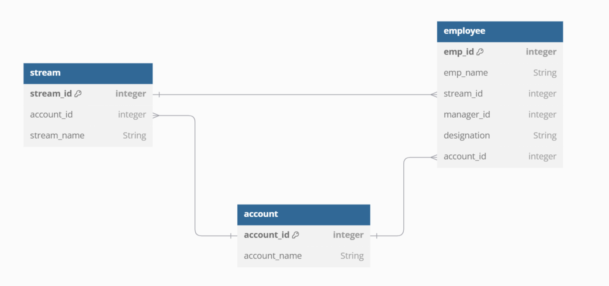

# Employee 

## Database Diagram

<center>

</center>

## API Methods

1. GET /api/employees/employee-name-start?starts-with-letter="M"

    - query-param : starts-with-letter 
    - query-param-required : true
    - response-status : 200
    - response : employee details as JSON
    ```json
    
    [
        {
            "name"  : "Mathew John",
            "id" : 1,
            "stream" : "Sales",
            "designation": "Manager",
            "accountName" : "Smart Ops",
            "managerId": 0
        },

        {
           
            "name"  : "Manu Mohan",
            "id" : 2,
            "stream" : "Sales",
            "designation": "Associate",
            "accountName" : "Smart Ops",
            "managerId" : 1, 
        }
    ]
    
    ```

2. GET /api/employees/allstreams
    - query-param-required : false
    - response-status : 200
    - response : streams details as JSON
    ```json
    {
        "streams":[
            "Sales","G&A","Delivery"
        ]
    }
    ```

3. PUT /api/employees/update/employee-id=8&manager-id=5
    - query-param : employee-id
    - query-param : manager-id
    - query-param-required : true
    - response-status : 200
    - response
    ```json
    {
        "message":"Sam Daniel's manager has been changed from Mathew John to Akash Kumar"
    }
    ```