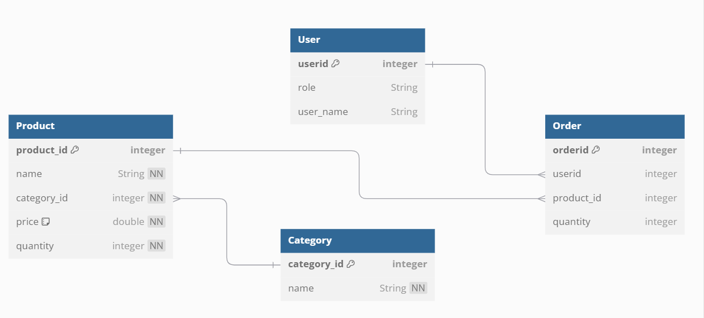

# Inventory management system 

## Database Diagram
<center>

</center>

## API Methods

1. POST /api/ims/create-category

    - request-body: category details as JSON
    ```json
        {
            "category_id":101,
            "name":"grocery",
        }
    ```
    - response-status : 200
    - response-body: 
     ```json
    {
        "message":"Category created successfully"
    }
    ```

2. POST /api/ims/create-product 

    - request-body: product details as JSON
    ```json
        {
            "product_id":1,
            "name":"rice",
            "category_id":101,
            "price":55.00,
            "quantity":10
        }
    ```
    - response-status : 200
    - response-body: 
     ```json
    {
        "message":"Product created successfully"
    }
    ```

3. GET /api/ims/products
    - query-param : category-id
    - query-param : product-id
    - query-param-required : false
    - response-status : 200
    - response : product details as JSON

    ```json
    [
        {
            "id":1,
            "name":"rice",
            "category_id":101,
            "price":55.00,
            "quantity":10
        },
        {
            "id":2,
            "name":"wheat",
            "category_id":101,
            "price":65.00,
            "quantity":12
        },
        {
            "id":3,
            "name":"coffee",
            "category_id":102,
            "price":80,
            "quantity":15
        }
    ]
    
    ```

4. GET /api/ims/category?category-id=101

    - query-param : category-id
    - query-param-required : true
    - response-status : 200
    - response : category details as JSON
    
    ```json

    {
        "id":101,
        "name":"grocery",
    }

    ```
5. UPDATE /api/ims/update/{product_id}
 
    - request-body : Updated Product details as json
 
    ```json
        {
            "name" : "Barley",
            "category_id" : 101,
            "price" : 105.00,
            "quantity" : 5
        }
    ```
 
    - response-status : 200
    - response-body:
 
     ```json
        {
            "message" : "Product updated successfully"
        }
    ```
 
6. UPDATE /api/ims/update/{category_id}
 
    - request-body : Updated Category details as json
 
    ```json
        {
            "name" : "Beverages"
        }
 
    ```
 
    - response-status : 200
    - response-body:
 
     ```json
        {
            "message":"Category updated successfully"
        }
    ```

7. DELETE /api/ims/delete_category?category-id=101

    - query-param : category-id
    - query-param-required : true
    - response-status : 200
    - response : 

    ```json
    {
        "message":"Successfully deleted grocery from the category list"
    }
    ```

8. DELETE /api/ims/delete_product?product-id=1

    - query-param : product-id
    - query-param-required : true
    - response-status : 200
    - response : 
    
    ```json
    {
        "message":"Successfully deleted rice from the product list"
    }
    ```

9. UPDATE /api/ims/sold?product-id=2 & quantity=5

    - query-param : product-id
    - query-param : quantity
    - query-param-required : true
    - response-status : 200
    - response : 

    ```json
    {
        "message":"Successfully sold out the product with id: 2"
    }

    ```

10. UPDATE /api/ims/re-stock?product-id=2 & quantity=10

    - query-param : product-id
    - query-param : quantity
    - query-param-required : true
    - response-status : 200
    - response : 

    ```json
    {
        "message":"Successfully restocked the product with id: 2"
    }
    
    ```


